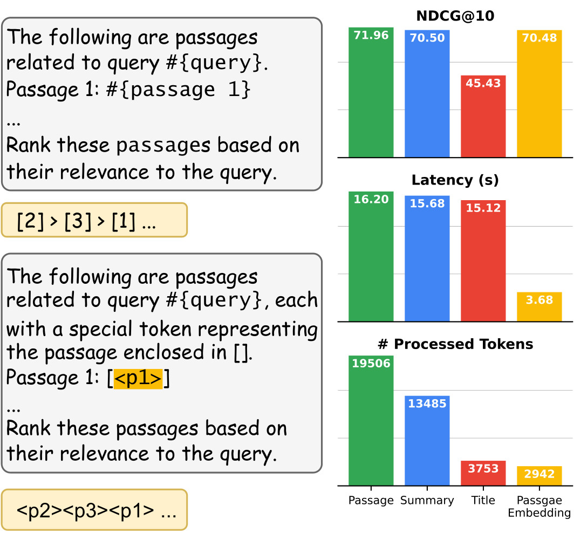

# PE-Rank

Code for paper [Leveraging Passage Embeddings for Efficient Listwise Reranking with Large Language Models](https://arxiv.org/abs/2406.14848)

<p align="center">
  
</p>
<p align="left">
  <b>Figure 1:</b> Comparison between RankGPT (upper) and PE-Rank (lower). RankGPT takes the whole passages as input and outputs ordered numbers, while PE-Rank takes a list of special tokens as both input and output. On the right side, we show the reranking results on DL19 using different forms of inputs.
</p>

## Installation

```bash
git clone git@github.com:liuqi6777/pe_rank.git
```

## Evaluation

The checkpoint of the PE-Rank model is available in this link: [PE-Rank](https://huggingface.co/liuqi6777/pe-rank-mistral-jina).

### Retrieval

We provide the scripts for first-stage retrieval, for example, you can use the following command to use BM25 as the retrieval model:

```bash
python src/scripts/run_evaluation.py --dataset dl19 --retriever bm25 --topk 100
```

This code will run the BM25 retrieval model on the DL19 dataset and save the retrieval results to `results/retrieval_results/bm25/dl19_top100.jsonl`.

As alternative, we also provide all the retrieval results in this link: [https://huggingface.co/liuqi6777/pyserini_retrieval_results](https://huggingface.co/liuqi6777/pyserini_retrieval_results). You can download the retrieval results to `results/retrieval_results` folder.

### Reranking

To run the reranking stage, you can use the following command:

```bash
python src/evaluate.py --datasets dl19 --model-path liuqi6777/pe-rank-mistral-jina --retriever bm25 --topk 100
```

The reranking results will be saved to `results/reranking_results/eval_dl19_pe-rank-mistral-jina_top100.txt` and you can use the following compute the evaluation metrics:

```bash
python src/scripts/trec_eval.py --dataset dl19 --ranking results/reranking_results/eval_dl19_pe-rank-mistral-jina_top100.txt
```

For other datasets or other retrieval models, just replace the `--datasets` and `--retriever` arguments.

### More usage

Comming soon.

## Training

If you want to train the PE-Rank model from scratch or using customized settings, you can follow the instructions below.

### Data Preparation

All datasets used in the paper are available in this link: [pe_rank_data](https://huggingface.co/datasets/liuqi6777/pe_rank_data). Please download the data to `data` folder.

For example, you can run the following command:

```bash
git clone git@hf.co:datasets/liuqi6777/pe_rank_data ./data
```

You can refer the paper for more details about the datasets.

### Alignment Stage

To run the alignment stage, you can use the following command:

```bash
deepspeed --include="localhost:0,1,2,3" src/train.py \
    --deepspeed scripts/zero2.json \
    --model_name_or_path mistralai/Mistral-7B-Instruct-v0.2 \
    --data_path ./data/wiki2m.jsonl \
    --encoder_name jinaai/jina-embeddings-v2-base-en \
    --encoder_pooling mean \
    --projector_type mlp2x_gelu \
    --freeze_backbone \
    --tune_mlp_adapter \
    --bf16 \
    --output_dir ./checkpoints/mistral.jina.projector \
    --num_train_epochs 1 \
    --per_device_train_batch_size 1 \
    --gradient_accumulation_steps 1 \
    --evaluation_strategy "no" \
    --save_strategy "steps" \
    --save_steps 1000 \
    --save_total_limit 1 \
    --learning_rate 1e-3 \
    --warmup_ratio 0.03 \
    --lr_scheduler_type "cosine" \
    --logging_steps 1 \
    --tf32 True \
    --model_max_length 512 \
    --gradient_checkpointing \
    --attn_implementation flash_attention_2 \
    --dataloader_num_workers 4
```

This command will run the alignment stage using the Mistral-7B model as the backbone and Jina-Embeddings as the encoder.

### Learning-to-Rank Stage

To run the learning-to-rank stage, you can use the following command:

```bash
deepspeed --include="localhost:4,5,6,7" --master_port="29700" src/train.py \
    --deepspeed ./scripts/zero2.json \
    --model_type rank_lm \
    --model_name_or_path mistralai/Mistral-7B-Instruct-v0.2 \
    --data_path ./data/train.jsonl \
    --use_embedding_with_content True \
    --use_embedding_without_content True \
    --kl_loss_weight 0.2 \
    --loss1_weight 1 \
    --loss2_weight 1 \
    --encoder_name jinaai/jina-embeddings-v2-base-en \
    --encoder_pooling mean \
    --pretrain_mlp_adapter ./checkpoints/mistral.jina.projector/projector.bin \
    --projector_type mlp2x_gelu \
    --tune_mlp_adapter \
    --bf16 True \
    --tf32 True \
    --output_dir "./checkpoints/pe-rank-mistral-jina" \
    --overwrite_output_dir \
    --num_train_epochs 1 \
    --per_device_train_batch_size 4 \
    --gradient_accumulation_steps 2 \
    --save_strategy "steps" \
    --save_steps 3000 \
    --save_total_limit 2 \
    --learning_rate 2e-5 \
    --warmup_ratio 0.03 \
    --lr_scheduler_type "cosine" \
    --logging_steps 1 \
    --model_max_length 4096 \
    --gradient_checkpointing True \
    --attn_implementation flash_attention_2 \
    --dataloader_num_workers 2
```

This command will run the full learning-to-rank stage.

## Citation

```bibtex
@article{liu2024leveraging,
  title={Leveraging Passage Embeddings for Efficient Listwise Reranking with Large Language Models},
  author={Liu, Qi and Wang, Bo and Wang, Nan and Mao, Jiaxin},
  journal={arXiv preprint arXiv:2406.14848},
  year={2024}
}
```
